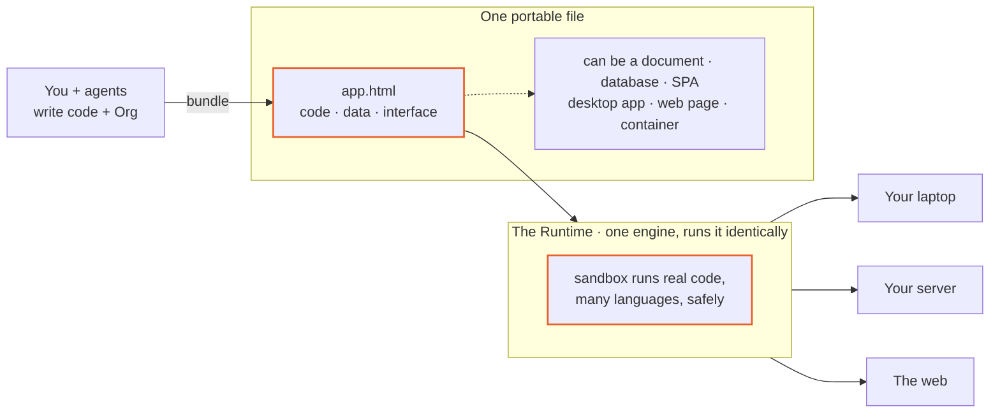
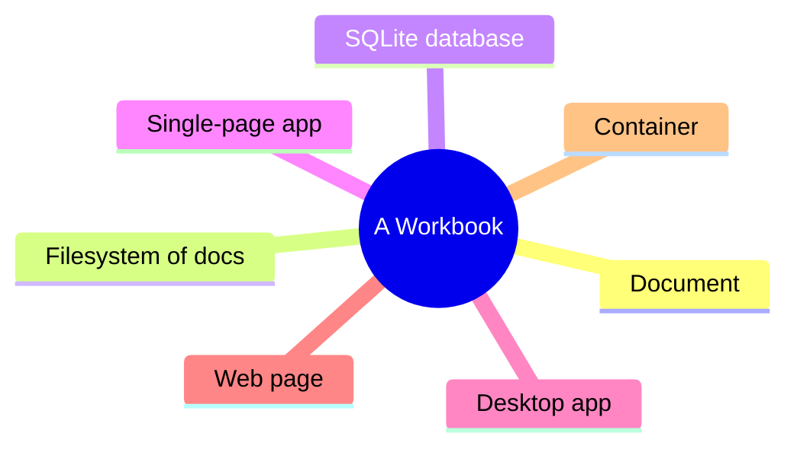
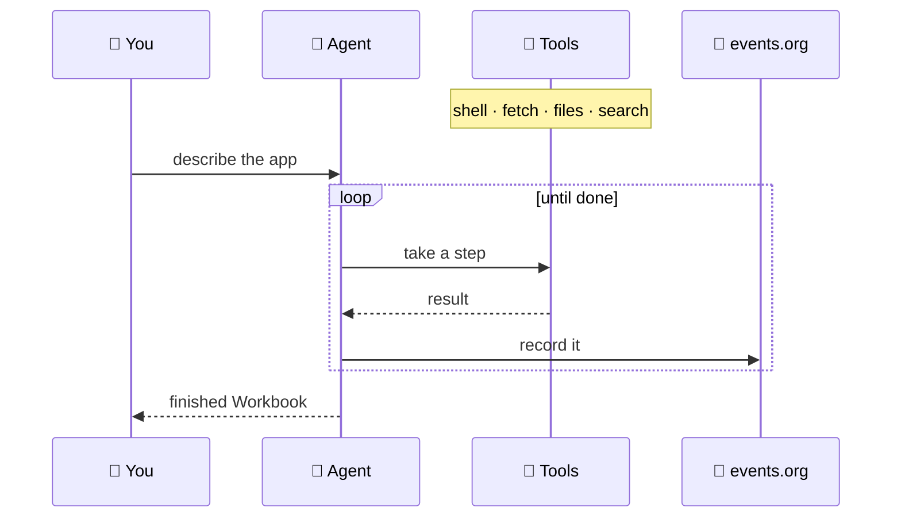
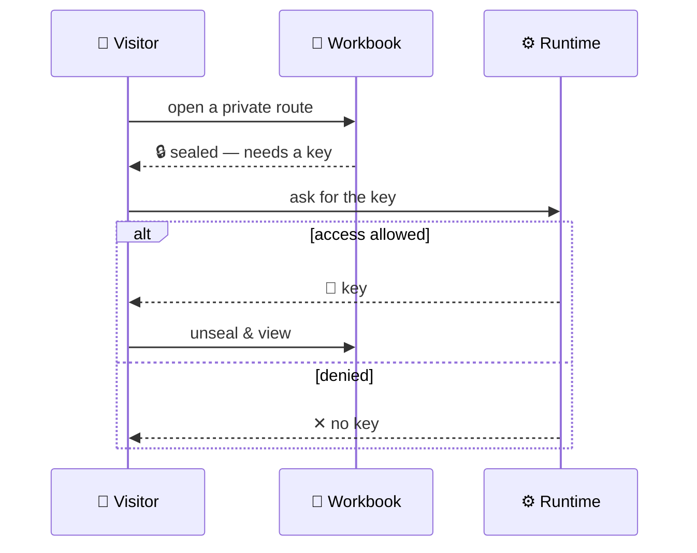

<div align="center">


# Workbooks

**A file format for whole apps — and the runtime that runs them anywhere.**

[](LICENSE)
&nbsp;[](https://github.com/workbooks-sh/workbooks.sh)
&nbsp;
&nbsp;

</div>

A Workbook is one file that holds an entire working app — its code, its data, and its
interface. The Runtime brings that file to life the same way on your laptop, your server,
or the web. You build with agents, you own the result, and it runs on infrastructure you
control.



## The idea

Think of a Workbook like a PDF — one file you can open, send, or keep — except the file
isn't a document, it's a running app.

That works because of two halves that fit together:

- **The Workbook** is the format. It's *what* you build: one portable file with the code,
  data, and interface inside it. No project folder, no repo to clone, no service that has
  to stay alive.
- **The Runtime** is the engine. It's *what runs* the format — identically on your machine,
  your server, or the web — and it can run real code, in several languages, safely.

The file is portable because the engine runs everywhere. The engine matters because the
file is portable. One promise, two halves.

## What a Workbook is

You build a Workbook the normal way — writing real code (Svelte, SolidJS, Rust, and more)
— with Org as a connective layer that ties the pieces together. The bundler packs all of
it into a single, self-contained `.html`. Because everything it needs is inside that one
file, the same Workbook can be many things:

- a **document** you read
- a **filesystem** of documents
- its own **SQLite database** — a real data store inside the app, not just a file tree
- a **single-page app** (Svelte, SolidJS, plain JSX)
- a **desktop app** or a plain **web page**
- a **container** — a sandbox that runs untrusted code safely

Hand someone a Workbook and they have the working app — not a link to a service you have
to keep paying to keep alive. And because it's HTML at the surface, it drops into anything.



## What the Runtime is

One Runtime runs your Workbook everywhere. It's built on Elixir, so it stays fast and
parallel under load without you babysitting a scaling dashboard, and it runs real code —
in several languages — inside a sandbox, so even untrusted code stays in its box. One
Runtime means one thing to manage, not a fleet.

You can run it yourself, for free, on your own machine with your own API keys. When you'd
rather not manage infrastructure, you can let us run it for you in the cloud — but that's
a convenience, never a gate.

## Why it's built this way

**Cheaper to run, on purpose.** Workbooks doesn't rent you space in a cloud vendor's
runtime and bill you per request. You run it on infrastructure you control — so your cost
is your own machine, not a meter that climbs with every bit of traffic.

**Built for agents and people to build together.** Agents and humans work in the same
format and share the same data. Authoring, testing, shipping, and publishing are all
designed to be things an agent can do — not just a human.

**The structure is the memory.** There's no bolt-on "memory" system. Because a Workbook
keeps code and context together in one readable format, an agent gets the context it needs
from the file itself — which keeps it on track instead of drifting.

**Opinionated where it counts.** The Runtime makes a few decisions for you so everything
speaks the same language and connects to the same data. That's what makes a pile of
separate tools behave like one system.

## How it works

**An agent builds it.** You describe what you want; the agent works in a loop — taking one
step at a time with a small set of tools — and records every step so you can see exactly
what it did.



**Private routes stay sealed.** A route is just a path inside the Workbook. Public paths are
plain; the ones you mark private are encrypted, and the Runtime hands over the key only
after an access check. A private page isn't hidden — it's unreadable without permission.



## The primitives

Workbooks is a handful of small ideas that fit together. Each one does a single job.

**Workbook** — the format. Your code plus an Org layer that ties it together, bundled into
one self-contained `.html`. Holds code, data, and interface; can be a document, a database,
an app, or a container.

**Bundle** — the packer. Takes your source — real code files and the Org that connects
them — and packs it into the single `.html` (and back out again, so a Workbook is never a
black box). This is the step that turns a project into one portable file.

**Runtime** — the engine. A single Elixir/BEAM host with WebAssembly (wasmtime) inside.
Runs Workbooks, drives agents, and records everything it does to a queryable log
(`events.org`).

**Container** — safety. Every Workbook runs as a sandboxed WebAssembly component with its
own memory and time limits. It only gets the capabilities you grant it; untrusted code
can't reach past its box, and a crash inside never takes the host down.

**Compilers** — languages, in the sandbox. Code compiles *to* WebAssembly — never to native
machine code — right inside the sandbox. Pull a package and run it without trusting it.
C and Zig work today; Rust, Go, and Python are on the way.

**Agents** — the builders. An agent can author, test, ship, and publish a Workbook for you.
It works through a small set of tools — a shell, fetch, the file store, search — and writes
every step to `events.org`, so you can see exactly what it did.

**Memory** — context that doesn't drift. There is no separate memory database. A Workbook
keeps its code and its context together in one readable file, so an agent reads its context
straight from the work — which is what keeps it on track.

**OQL** — the query layer. A small language for reading and checking a Workbook's structure:
list its parts, validate it, or plan a build. The same kernel runs in the browser, the
desktop app, and the Runtime.

**Identity** — who made it. Each Workbook is signed with its owner's key (Ed25519, exposed
as a `did:key`), so anyone can verify a Workbook is genuine and unaltered. Logins are handled
with standard JWTs.

**Seal** — routing with auth built in. A Workbook is a bundle whose directory of paths *is*
its route table — every route is just a path inside the file. Routes you mark private are
**sealed** (encrypted), and the Runtime hands over the key only after an access check. So a
private page isn't hidden, it's unreadable without permission. Any frontend router plugs in
(SvelteKit, TanStack, React, SolidJS, Vite) through a thin adapter.

**Sharing** — your work, moved safely. Workbooks are backed by Git, so history, diffs, and
rollback come for free. They can also be published and fetched peer-to-peer over Radicle,
identified by the same keys above.

**Deploy** — shipping it. One image runs the Runtime in a local container or on a cloud
machine. `wb deploy` scaffolds the config and ships it.

## Try it

```bash
wb run app.org      # run a workbook
wb publish app.org  # ship it
```

That's the loop.

<details>
<summary>Run from source, or deploy to your own server / the cloud</summary>

```bash
# Run the Runtime from source
cd runtime
mix deps.get && mix compile
iex -S mix                 # dev
MIX_ENV=prod mix release   # production build

# Deploy: one OCI image, run it locally or on a cloud machine
wb deploy init             # scaffold the config
wb deploy local            # run it in a local Linux container
wb deploy apply deploy.org # ship it to a cloud machine
```

The Runtime is one self-contained container: BEAM + wasmtime + the baked WASM artifacts.
The whole server lives in `runtime/host/`.

</details>

## What's in here

| Directory | What it is |
|-----------|------------|
| `runtime/` | **The product.** The Elixir host (`host/` — the agent loop, OQL, the file store, the web surface), the OQL kernel (Rust → `oql.wasm`) in `kernel/`, the WebAssembly interfaces in `wit/`, and the baked WASM commands in `build/`. |
| `desktop/` | The **workbook-native** desktop app (Tauri). Embeds the OQL kernel and edits/runs workbooks **offline, no server** — and optionally connects to a Runtime for agents and sync. See `desktop/README.md`. |
| `toolkits/` | Capability toolkits the Runtime discovers — like `presentation` (reveal.js) and `video` (hyperframes) — wrapped as agent skills. |
| `web/` | The landing page and the in-browser workbook viewer. |

## License

[Apache 2.0](LICENSE). Free and open source, end to end — the format, the Runtime, and the
desktop app.
