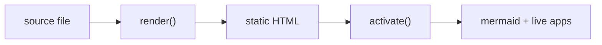

# Writing for the Web

Author: The Orgitorial Team
Date: 2031-11-22
Keywords: writing, publishing, plain-text

Plain text outlives every CMS. This post is itself a plain-text file, rendered
to the page you're reading by **orgitorial** — a single zero-dependency
renderer. It doubles as a kitchen sink: every construct below is live proof
that the toolkit handles it. If you can write a blog post, you already know
enough to ship.

## Why plain text

Plain text is a *legible* outline format. The markup is small, legible, and
**durable** — which is exactly what you want for content you'll keep for a
decade. You get structure (`headlines`), rich text, lists, tables, and code,
with none of the lock-in of a database-backed editor.

The pitch in one line: write once in plain text, render anywhere with one file.

### Emphasis you'll actually use

You can make text **bold**, *italic*, _underlined_, or ~~struck through~~.
Inline code comes in two flavors: `verbatim` (literal) and `code` (a token).
Links are first-class: [the home page](https://orgmode.org), or a
bare URL like https://workbooks.sh that auto-links. Footnotes[^1] keep your
prose clean while still citing your sources.

### Timestamps and tags

Dates are native. This post was filed 2031-11-22 (Sat), and headlines can
carry tags for lightweight categorization.

## Lists, the workhorse

Unordered lists use a dash:

- One renderer file, zero dependencies
- A complete CSS library, themed by custom properties
- Skills that document the class contract
  - Nesting just works — indent two spaces
  - Go as deep as the idea requires

Ordered lists count for you:

1. Write your post in plain text
2. Run it through `render()`
3. Drop in the stylesheet
4. Ship

And checkboxes track real state:

- [x] Renderer ships as one file
- [x] CSS themed entirely via variables
- [-] Syntax highlighting (the class hook is there; bring your own)
- [ ] Your next post

An image link renders as an `` — point it at any `.png/.jpg/.svg`:


## Tables without the pain

A header row is separated by a rule line:

| Construct   | Syntax            | HTML class      |
|-------------|-------------------|-----------------|
| Headline    | `# Title`         | `h2.org-h`      |
| Source      | ```` ``` ````     | `pre.org-src`   |
| Quote       | `> ...`           | `blockquote`    |
| Checkbox    | `- [ ] item`      | `li.org-check`  |

## Code, quoted and highlighted

Source blocks preserve whitespace, escape your HTML, and label the language:

```javascript
import { render } from "./orgitorial.js";

const html = render(text);             // string in, string out
document.querySelector("#post").innerHTML = html;
```

A plain example block (no language bar) is for literal output:

```
$ node -e "import('./dist/orgitorial.js').then(m => console.log(m.render('# hi')))"
<article class="org-doc"><h2 class="org-h">hi</h2></article>
```

And a quote, for when someone said it better:

> The best format is the one you can still read in twenty years.

A verse, keeping line breaks — handy for a pull-stanza or a snippet of poetry:

> Plain text in,
> clean HTML out —
> one file does it,
> no build to doubt.

## Living blocks: diagrams and mini-apps

An article can also be a workbook. Three block types turn a static post into a
living document — and none of them inner-scroll or sit in a cramped iframe.

A **Mermaid diagram** beats a paragraph when you're describing a flow. Write it
as a `mermaid` code block; the host page's `Orgitorial.activate(document)` call
renders it (lazy-loading mermaid from a CDN only if a diagram is present):



A **wide quote** can break out of the editorial column — past the measure, but
never the whole viewport:

> The best interface for a document is the document itself — readable as plain
> text, alive when you open it in a browser, and the same one file either way.

And a **full-bleed mini-app**: a self-contained `html :app` block with inline
styles and an inline script that runs on `activate()`. Here's a 20-line
compounding estimator, edge to edge:

```html
<div style="font-family:system-ui,sans-serif;max-width:46rem;margin:0 auto;padding:1.5rem 1.25rem;text-align:center">
  <label style="display:block;font-size:.85rem;letter-spacing:.04em;text-transform:uppercase;color:#888;margin-bottom:.6rem">
    Monthly deposit
    <input id="amt" type="range" min="50" max="2000" step="50" value="300"
           style="display:block;width:100%;margin-top:.6rem;accent-color:#b3411f">
  </label>
  <div style="font-size:2.4rem;font-weight:700;line-height:1.1;margin:.4rem 0">
    <span id="dep">$300</span>/mo →
    <span id="total" style="color:#b3411f">$0</span>
  </div>
  <div style="font-size:.8rem;color:#888">after 30 years at 7% / yr, compounded monthly</div>
  <script>
    (function () {
      var amt = document.getElementById("amt");
      var fmt = function (n) { return "$" + Math.round(n).toLocaleString(); };
      function recompute() {
        var p = +amt.value, r = 0.07 / 12, n = 30 * 12;
        var fv = p * ((Math.pow(1 + r, n) - 1) / r);
        document.getElementById("dep").textContent = fmt(p);
        document.getElementById("total").textContent = fmt(fv);
      }
      amt.addEventListener("input", recompute);
      recompute();
    })();
  </script>
</div>
```

## Drawers for metadata

Property drawers fold away the machinery so the prose stays clean. They render
collapsed by default — click to expand:

- ID: writing-for-the-web
- Category: tutorial
- Readtime: 4 min

## Roadmap, as headline state

Headlines can carry TODO/DONE keywords — a native way to track work.
orgitorial renders the keyword as a colored state chip:

- **DONE** One-file renderer
- **DONE** Editorial CSS, themed by variables
- **TODO** Pluggable syntax highlighting
- **TODO** Your contribution

## Where it goes

orgitorial is built to plug into anything: a static site, the workbooks
living-lander blog, a bit.ml story. The renderer is pure string→string, so it
runs in a browser tag, in Node at build time, and in the runtime's JS wasm lane.
Re-theme it by setting a few CSS variables; the class contract is the whole API.

---

That's the kitchen sink. Everything above this rule is a supported construct,
rendered by the same one file you'd ship.

[^1]: A footnote is reference-and-definition: drop `[^1]` inline, define it
later with `[^1]: the text`. orgitorial collects them into a Footnotes
section at the end, with backlinks.
