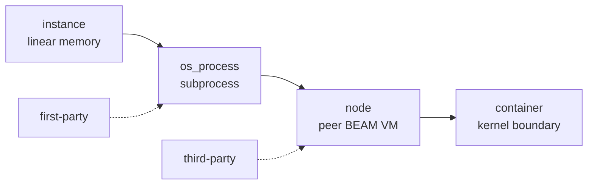

# Isolation tiers

> Four escalating containment tiers, assigned by the host, never by the toolkit.

A toolkit doesn't choose its own cage. Based on its `#+TRUST` posture and shape,
the host runs it at one of four escalating tiers. The direction is one-way: the
host can only **tighten**.

| tier | boundary | isolates against |
| --- | --- | --- |
| `instance` | linear memory | memory corruption, ungranted caps |
| `os_process` | a separate process | runaway CPU, native-level crashes |
| `node` | a separate BEAM VM | host-side crashes; spans machines |
| `container` | a separate container | hostile / multi-tenant workloads |

A `first-party` toolkit runs at its shape's natural tier (a command as a
subprocess, a kernel in-VM). A `third-party` toolkit is automatically escalated to
a separate VM — a crash there can't touch the runtime. The most hostile workloads
can be pinned to a network-less, resource-capped container.

Every tier is resource-leashed: memory ceilings, wall-clock timeouts, fuel, and at
the process/container tiers a hard kill. The worst a sandboxed toolkit can do is
spin CPU (and get killed) or hit a quota — never reach the machine.

The `node` tier is also where isolation and **distribution** become the same thing: a
peer VM can be on another box, so escalating containment and scaling out are one
move. See [the fabric](../run/fabric.md).

- Pick a trust posture: [Isolation tiers & trust](../run/tiers.md)
