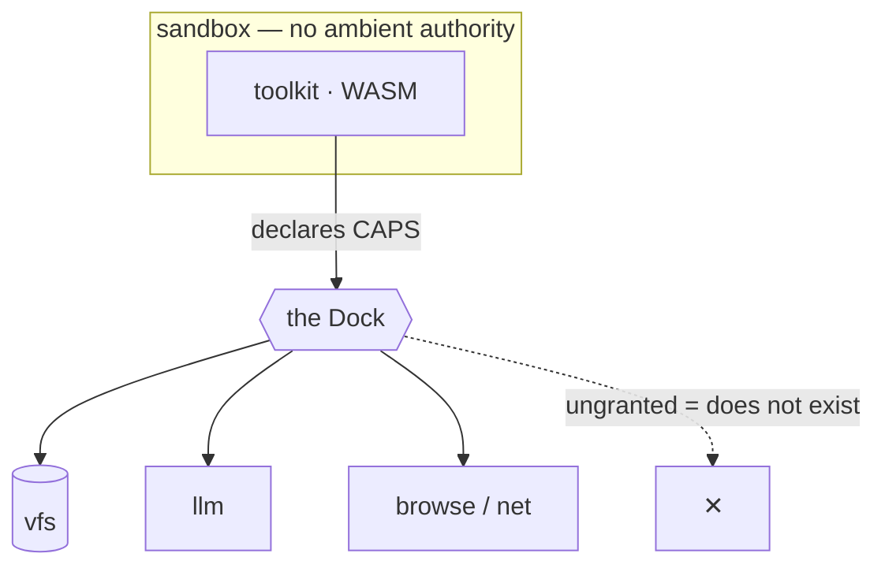

# What is a toolkit

> A toolkit is the unit of capability — packaged sandboxed WASM, authored in any language, run isolated, shipped inside a workbook.

A toolkit is the **unit of capability**.

If a workbook is the thing you ship, a toolkit is what you build to make it do
more: a packaged piece of sandboxed WebAssembly that does one thing, written in
any language, run isolated, and distributed as a workbook.

You already know the shape of this idea — a toolkit is the thing that has been
called many names:

| It's like a… | …but |
| --- | --- |
| npm package | language-agnostic, capability-gated, isolation-tiered |
| Unix tool on PATH | it's sandboxed WASM, not a native binary |
| Claude skill | it's **executable**, not just a prompt |
| Lambda function | deterministic, content-addressed, and it ships in a document |

The difference that matters: a toolkit can't reach your machine. It's WASM with no
ambient authority — it does only what it's explicitly granted, and the host
decides how isolated it runs.

## What's inside one

A toolkit is a small, self-describing bundle:

```text
  my-toolkit/
    manifest.org      the front door — what it is, how it runs (#+EXEC), what it needs (#+CAPS)
    skills/           progressive-disclosure recipes that teach an agent to use it
    src/              your source, in any supported language
    <name>.wasm       the compiled artifact (built in-sandbox, content-addressed)
```

Two halves: the **manifest + skills** teach a human or an agent how and when to use
it; the **WASM** is the thing that actually runs. You write the source; the runtime
compiles it to WASM inside its own sandbox — there's no toolchain to install on
your machine, and untrusted source never touches a native compiler.

## It picks a shape

A toolkit isn't one fixed kind of thing. Its manifest declares an `#+EXEC` shape
that says **how it runs**:

| `#+EXEC` | what it is |
| --- | --- |
| `command` | argv + stdin → stdout (a CLI, the default) |
| `component` | a typed, in-process WIT component |
| `kernel` | a `bytes → bytes` hot loop (media / render) |
| `task` | a runnable recipe, no compiled binary |
| `federation` | a live data source + sync daemon |
| `posix` | a native binary, for the things WASM can't |

Same package format, same build pipeline, same trust model — the shape just
selects how the artifact is invoked. See [the six shapes](exec-shapes.md) for what each is for.

## It reaches the host through the Dock

Pure compute needs nothing. The moment a toolkit wants to do something it can't do
alone — read storage, call a model, fetch a URL, fan work across cores — it asks
the host through **the Dock**: a typed, capability-gated surface. A toolkit declares
the capabilities it needs (`#+CAPS`); the host grants only those; an ungranted
capability simply doesn't exist for it.

The host holds the credentials and owns the egress. A toolkit that fetches a URL
never sees the API key and never opens a socket — it calls a capability, and the
host does the work. See [the Dock & capabilities](the-dock.md).



## The host decides how isolated it runs

You don't choose your own cage. Based on its trust posture, a toolkit runs at one
of four escalating tiers — a wasm instance, a separate OS process, a separate VM,
or a separate container — assigned by the host, never by the toolkit. More
untrusted means more contained, and the direction is one-way: the host can only
tighten. See [isolation tiers](isolation.md).

## Why this is the developer surface

Because a toolkit is the smallest thing you can write, run, and share that *does
something* on this platform — and it composes everywhere. The same artifact is
called by an agent over bash, by a workbook's HTML, by a workflow, by another
toolkit, or looped per-frame by the render fabric. You write a capability once;
the whole system can use it.

Workbooks are what you ship. Toolkits are how you make them do more.

[Build one →](../start/first-toolkit.md)
