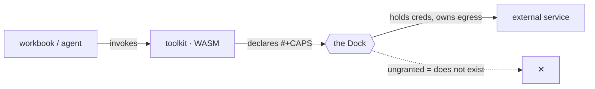

# Toolkits & integrations

> The toolkit library — every integration Workbooks can reach, browsable by capability, by service, and by EXEC shape, plus how to add your own.

- **MATURITY:** north-star
- **CAVEAT:** The public toolkit LIBRARY (a browsable, installable registry at a stable URL) is not yet published. The toolkits below ship in-repo today under toolkits/<id>/; this page documents the intended library ergonomics and is marked north-star until the registry is live.

A **toolkit** is the unit of capability — packaged sandboxed WebAssembly that does
one thing, authored in any language, run isolated, and shipped inside a workbook.
This is the **integration ecosystem**: the catalog of external services and local
capabilities a workbook (or its agent) can reach, plus how you author and add new
ones.

> New to the idea? Read the deep explanation once, then come back:
> [Giving it abilities](https://workbooks.sh/learn/giving-it-abilities.html) · [Safe powers](https://workbooks.sh/learn/safe-powers.html) · [Who sees what](https://workbooks.sh/learn/who-sees-what.html).
> The thin concept stub is [What is a toolkit](../concepts/what-is-a-toolkit.md) — this page is the **library**, not the lesson.

## How a toolkit works (the one-paragraph model)

A toolkit declares an `#+EXEC` shape (how it's called), the `#+CAPS` it needs
(what the host must grant), and a `#+TRUST` posture (how isolated the host runs
it). The host holds the credentials and owns egress: a toolkit that calls a
service never sees the API key and never opens its own socket — it asks a
capability across **the Dock**, and the host does the work. An ungranted capability
simply does not exist for it.



For **why** it is built this way — capability gating, isolation tiers, the
host-as-broker — read the canonical pages under [/learn](https://workbooks.sh/learn/). This section never
re-explains them; it links them and gets on with the catalog.

# Browse the library

The same toolkit appears under three indexes. Pick whichever matches how you're
thinking about the problem.

## By integration (service)

- **MATURITY:** partial
- **EVIDENCE:** toolkits/fly/deploy/bootstrap.sh:1
- **CAVEAT:** These ship in-repo under toolkits/<id>/ today. There is no published registry URL yet; "browse" means reading the manifests in the tree. Status reflects each toolkit's #+STATUS field.

The Zapier-style view: "Workbooks + <service>". Each links a detail page (see the
[integration page template](_template.md)).

| Integration | What it gives you | Status | Page |
| --- | --- | --- | --- |
| Workbooks + Fly.io | Deploy the engine / an app to a Fly machine | partial | [fly](fly.md) |
| Workbooks + Cloudflare | D1 + Workers AI + Pages on the user's account | experimental | (manifest: `toolkits/cloudflare/`) |
| Workbooks + Railway | Postgres + container hosting (BYOD path) | experimental | (manifest: `toolkits/railway/`) |
| Workbooks + GitHub | Repo / PR / issue operations via `git` + API | north-star | [github](github.md) |
| Workbooks + Slack | Post messages / notify a channel | north-star | [slack](slack.md) |
| Workbooks + Linear | Issue tracking sync | experimental | (manifest: `toolkits/linear/`) |
| Workbooks + Asana | Task sync | experimental | (manifest: `toolkits/asana/`) |

> **Caution:** A status of `north-star` on this table means the **detail page describes the intended integration** — the toolkit may be a stub or compose existing primitives. Always trust the toolkit's own `#+STATUS:` and its detail-page maturity drawer over this summary row.

## By capability (what the host must grant)

- **MATURITY:** ships-today
- **EVIDENCE:** runtime/host/policy.ex:29
- **SRC:** runtime/host/policy.ex#profiles

Group by the `#+CAPS` a toolkit needs. The cap names and the profiles that grant
them are defined in `policy.ex` (`minimal / network / posix`; the fail-closed
default `compute` = `vfs` only).

| Capability | What it lets a toolkit do | Example toolkits |
| --- | --- | --- |
| `vfs` | Read / write the sandbox filesystem | (every toolkit) |
| `net` / `browse` | Reach a URL (host opens the socket) | fly, github, slack |
| `secrets` | Use a host-held credential without seeing it | fly, github, slack |
| `llm` | Call a model | brandnana, video |
| `posix` | Run a native binary the host brokers | fly (flyctl), git |

See [Dock capabilities](../reference/caps.md) for the exhaustive, tangled-from-code cap list.

## By EXEC shape (how it's called)

- **MATURITY:** ships-today
- **EVIDENCE:** toolkits/git/manifest.org:4
- **SRC:** toolkits/git/manifest.org

Group by `#+EXEC`. Same package format, same trust model — the shape only selects
how the artifact is invoked.

| `#+EXEC` | What it is | Example toolkits |
| --- | --- | --- |
| `command` | argv + stdin → stdout (the default) | git, ffmpeg |
| `component` | a typed in-process WIT component | orgitorial, glyphs |
| `kernel` | a `bytes → bytes` hot loop | video, palette |
| `task` | a runnable recipe, no binary | fly (deploy recipe) |
| `federation` | a live data source + sync daemon | linear, asana |
| `posix` | a native binary for what WASM can't | flyctl, wrangler |

The six shapes in depth: [The six shapes](../concepts/exec-shapes.md) · field reference: [#+EXEC shapes](../reference/exec-shapes.md).

# Add a toolkit to your workbook

Two motions: **link an existing one** (you want a capability) and *author a new
one* (the capability doesn't exist yet).

## Link an existing toolkit

- **MATURITY:** north-star
- **CAVEAT:** The `wbx toolkit add <id>` install-from-registry verb is the intended ergonomics; a published registry is not live yet. Today you reference an in-repo toolkit by id and the runtime resolves it from toolkits/<id>/. The CLI surface here describes the target, not a shipped flag.

The intended one-liner — pull a toolkit from the library into the current
workbook by id:

```text
wbx toolkit add fly          # resolve from the library, grant its #+CAPS
wbx toolkit list             # what this workbook can reach
```

Until the registry ships, you reference a toolkit by its id and the runtime
resolves it from `toolkits/<id>/` in the tree. The credentials it needs are held
by the **host** (see each detail page's "How to add it"), never embedded in the
workbook.

## Author a new toolkit

- **MATURITY:** ships-today
- **EVIDENCE:** toolkits/AUTHORING.md:1
- **SRC:** toolkits/AUTHORING.md

When the capability doesn't exist, write one. The full guide is
[Pick a shape](../build/pick-a-shape.md) → [The Dock SDK](../build/dock-sdk.md); the manifest minimum is:

```org
#+TOOLKIT:    my-tool
#+EXEC:       command
#+TRUST:      first-party
#+BUILD_LANG: rust
#+BUILD_SRC:  path:src
#+CAPS:       vfs net
```

The runtime compiles your source to WASM **inside its own sandbox** — no toolchain
to install, and untrusted source never touches a native compiler. Authoring canon
lives in `toolkits/AUTHORING.md`.

## Submit it to the library

- **MATURITY:** north-star
- **CAVEAT:** Third-party signing + a public submission flow are designed but not shipped (toolkit surface map: prompt auto-injection, third-party signatures, desktop surface still open). Today, toolkits live in-repo; community submission is a planned registry feature.

The intended flow — sign your toolkit and publish it to the shared library so
others can `wbx toolkit add` it:

```text
wbx toolkit sign my-tool      # third-party signature (planned)
wbx toolkit publish my-tool   # push to the library (planned)
```

# Related

- Concept: [What is a toolkit](../concepts/what-is-a-toolkit.md) · [The Dock & capabilities](../concepts/the-dock.md) · [Isolation tiers](../concepts/isolation.md)
- Build: [Pick a shape](../build/pick-a-shape.md) · [The Dock SDK](../build/dock-sdk.md) · [Authoring skills](../build/skills.md)
- Reference: [Toolkit catalog & status](../reference/toolkits.md) · [Manifest fields](../reference/manifest.md) · [Dock capabilities](../reference/caps.md)
- Honesty: [Capability Matrix](../maturity/index.md)
- Integration page template: [_template.md](_template.md)
